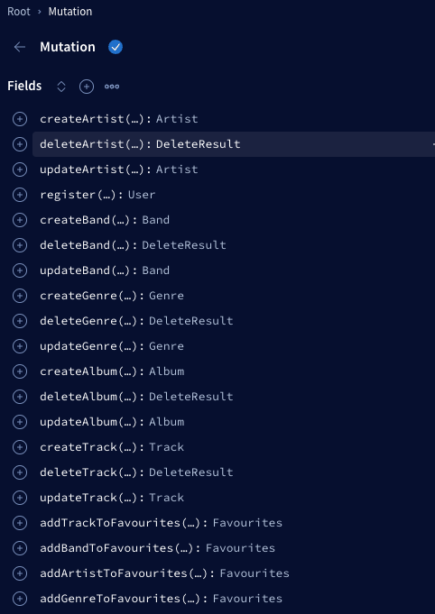
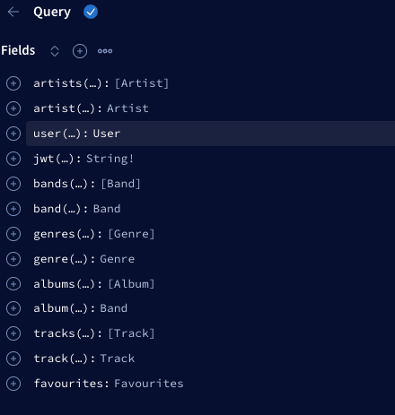
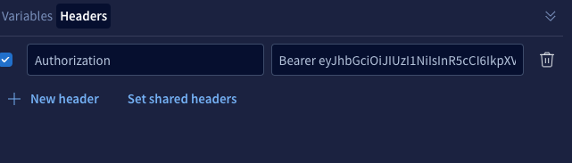

# grapql-server-nodejs

# **How to run**

1. Clone and install microservices according to instructions mentioned in it's readme file https://github.com/rolling-scopes-school/node-graphql-service
2. Run all microservices
3. Run `npm i` n current repo
4. Set up .env file according to .env example (take into account PORTS and urls set up in microservices repo)
5. Run `npm start:dev` to run it in dev mode or run `npm start:prod` to run it in prod mode.
6. If everything is fine you will see the message in console `Server ready at http://localhost:4000/`

# **Documentation and usage**

1. Navigate to your server URL -> Apollo studio website will be opened
2. Use features of apollo studio to fill the inputs and test requests.
3. Mutations available: 
4. Queries available: 

Notes: 
All the mutation are available only with user token. You have to register user and obtain jwt token using queries.

After that you have to send your requests with "Authorization" Bearer token. 

